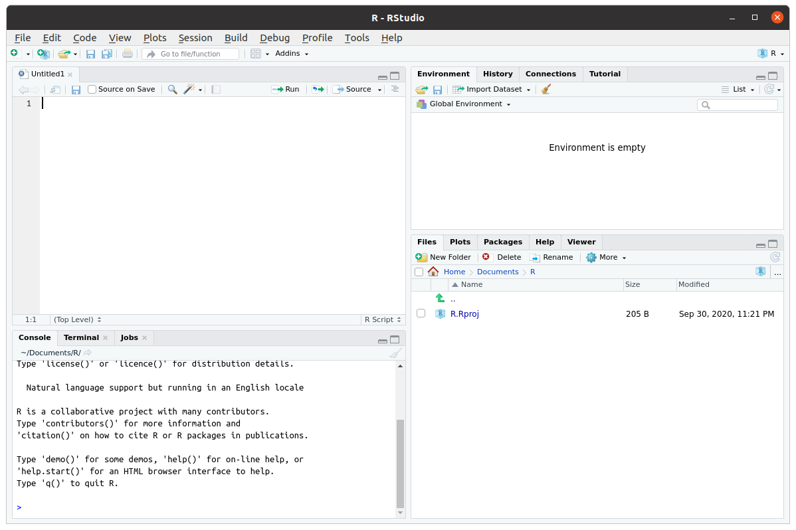

# Introduction

## What is R?^[This section contains material adapted from https://ourcodingclub.github.io/tutorials/intro-to-r/]

R is a statistical programming language that has rapidly gained popularity in many scientific fields. It was developed by Ross Ihaka and Robert Gentleman as an open source implementation of the "S" programming language. (Next time you need a fun fact, you can say "Did you know that S came before R?") R is also the name of the software that uses this language for statistical computing. With a huge online support community and dedicated packages that provide extra functionality for virtually any application and field of study, there's hardly anything you _can't_ do in R. 

If you already know your way around statistical software like `JASP` or `SPSS`, the main difference is that `R` has no __graphical user interface__, which means there are no buttons to click and no dropdown menus. `R` can be run entirely by typing commands into a text interface (welcome to the Matrix!). This may seem a little daunting, but it also means a whole lot more flexibility, as you are not relying on a pre-determined toolkit for your analyses.

If you need any more convincing, why are we using R and not one of the many other statistical packages like JASP, SPSS, MATLAB, Minitab, or even Microsoft Excel? Well, R is great because:

- R is free and open source, and always will be! Anybody can use the code and see exactly how it works.
- Because R is a programming language rather than a graphical interface, the user can easily save scripts as small text files for use in the future, or share them with collaborators.
- R has a very active and helpful online community - normally a quick search is all it takes to find that somebody has already solved the problem you're having.

## Getting started

If you want to use R and RStudio, you should _first install R_, and after that install RStudio. R and RStudio are separate programs, and RStudio requires R to be installed. 

### Download R

You can download R from [CRAN (The Comprehensive R Archive Network)](https://cran.r-project.org/). Select the link appropriate for your operating system and follow the instructions. You will want to download the installer for the latest release (currently version 4.0.2) of the base R software.

```{r, echo=FALSE}
knitr::include_url("https://cran.r-project.org/")
```

As you can see, the CRAN website has a rather distinctive "old-school" look. Don't let that fool you though. R itself is anything but old school.

### Download R Studio

R does not come with a graphical interface by default. Most people nowadays interact with R through second-party graphical platforms that provide extra functionality. Probably the most popular graphical front-end to R is __RStudio__. This is actually a full "integrated development environment" (IDE), but mostly, we will use it as a place where we can keep scripts, plots, and R output together in one place.

Like R, RStudio is open source software and free to download for anyone that wants to. You can download RStudio from [the RStudio website](https://rstudio.com/products/rstudio/) (select the free open source desktop version).

```{r, echo=FALSE}
knitr::include_url("https://www.rstudio.com/products/rstudio/")
```

<!-- If you are using a Mac, in addition to R and RStudio, you need to download XQuartz ([available here](https://www.xquartz.org/)). -->

## Working with RStudio

When you open RStudio, you will see something like Figure \@ref(fig:rstudio-interface-image). You will probably not see exactly the same layout, but once you click on `File` in the top menu, and then `New File > R Script`, you should be pretty close. You can get direct access to the R environment itself in the __console__ panel. If you type in commands here, they will be interpreted by R, and possibly some output is given. Working directly within the R console is handy if you want to do simple calculations, or try out different commands and functions. When you are conducting analyses, you will want to keep the commands that produce useful results somewhere, so you don't have to type in everything again if you want to rerun the analyses, or if you need to change something. That is where R _scripts_ come in handy. Basically, these are text files where you store a collection of commands that can be interpreted by R. Within RStudio, you can select lines of the script, and by clicking on `Run`, those lines will get pasted to the R console. R scripts should only contain working R commands. You can comment on your code by preceding a line (or the end of a line) by a hash-symbol ("#"). Anything after the has symbol is not evaluated by the R interpreter. 

```{r rstudio-interface-image, echo=FALSE, fig.cap='The RStudio interface consists of four main panels. The _source_ panel (top left) is where you can keep scripts. The _console_ panel (bottom left) is where the R commands and text output go; this is where R truly lives. The _environment and history_ panel (top right) shows which R objects are currently available in memory and a history of all the R commands the R console received.  The _files, plots, packages, etc_ panel contains a file browser, a display panel for all plots, a list of installed R packages, and a browser for help files.', out.width="100%"}

```

Another useful way to store R commands is in a different file format, called `R Markdown`. R Markdown allows you to combine text, plots, and R commands all in a single file. This file can then be "parsed" to produce a variety of document formats, such as HTML, pdf, and even Microsoft Word. If you click on `File > New File > R Markdown` in RStudio, you can see an example of such a file. As the name suggests, R Markdown is a combination of R and Markdown. Markdown is a lightweight markup language for creating formatted text documents with a plain-text editor. A markup language is, roughly put, a system which defines elements in a document by their role, for instance defining certain elements as titles or headers, and others as quoted text or test that should be emphasised. Common examples of markup languages are HTML and XML. If you know a little HTML, you might know that in modern implementations, it separates content and markup (HTML) from style (CSS). This separation allows you to easily create a variety of documents which are visually very different from the same HTML source file. When you use a word processor such as Microsoft Word, it creates a single document which specifies both content and style, and in a way which is specific to the word processor used. Markdown aims to provide a way to define a software-agnostic markup language, separating content from style, which can be used to produce a variety of output formats from the same source file. R markdown add to this an integration with R. Effectively, R Markdown first evaluates all the R code in an R Markdown file to create a "plain" markdown file, which can then be parsed into a variety of output formats. The great thing about this is that you can create automatically reproducible documents, and you don't have to copy-paste results of analyses between R and your word processor, avoiding the common mistakes that this brings. And R Markdown is really flexible. For example, using a package like `bookdown`, you can even write whole books in R Markdown (like this one)! We will discuss R Markdown in more detail at a later point. If you want to get started already, a very useful resource is [R Markdown: The Definitive Guide](https://bookdown.org/yihui/rmarkdown/). 

## Installing packages

Part of the popularity of R stems from the thousands of packages that extend the basic capabilities of R. Packages extend the functionality of base R, and can provide new objects, functions, datasets, etc. Before these additional packages can be used, they need to be installed first.

### Installing the `sdamr` package

The "Statistics: Data analysis and modelling" book has an associated R package which contains the data sets used as examples in the book, as well as some additional functions. It is available from the Comprehensive R Archive Network (CRAN), which is a large repository of R packages. You can install the package from there by simply typing in the R console:

```{r, eval=FALSE}
install.packages("sdamr")
```

If for some reason the `sdamr` package is not available there, you will see a warning (`package ‘sdamr’ is not available for this version of R`). If that happens, you can install the development version from GitHub (see below). <!-- , you can install the package As it is still in development as I'm writing, it is not hosted on CRAN yet. That doesn't mean you can't install the package, but it requires a tiny bit more work.-->

The source code of the `sdamr` package is hosted in GitHub, and the package can be installed from there as well with help of the `remotes` package. So you will first need to install that package, and then you can use the `install_github` function to install the `sdamr` package: 

<!-- Much of this is related to installing packages from source code rather than from pre-compiled binary sources. Linux and Mac OSX versions of R by default come with the ability to install packages from source. On Microsoft Windows, you will need to install some additional software to do this.

#### Installing RTools (Windows only)

```{r}
knitr::include_url("https://cran.r-project.org/bin/windows/Rtools/")
```

-->

```{r, eval=FALSE}
install.packages("remotes")
remotes::install_github("mspeekenbrink/sdam-r")
```

Note that by typing `remotes::` before the function call, we are telling R that the function is available in the `remotes` package. This avoids you having to load the package (i.e. by `library(remotes)`) first.

### Loading packages

Once installed, the functionality of additional packages can be made available by loading them with the `library` function.

To load the `sdamr` package, you would type 
```{r}
library(sdamr)
```

This also provides a check whether the package is properly installed (if not, you will get an error message). Technically, loading a package with the `library()` function attaches all its functions and datasets to the global namespace. Roughly speaking, that means that if you type in the name of a function from a package, `R` will now where to look for the code of that function so that it can execute it. 

## Getting help

R may be tricky to master, especially at the start, but help is never far away:

* From within R
    + If you want more information on a specific function, use a question mark before it (e.g., `?plot`) or the `help` function (e.g., `help(plot)`)
    + If you don't know the function name, use two question marks (e.g., `??plot`) or the `help.search` function (e.g., `help.search("plot")`)
    + If you know a function is in a package, use search help on the package (e.g., `?ggplot2`)
    + The `RSiteSearch("keyword")` function will will search for "keyword" in
all functions available in R, associated packages, and the R-Help News
groups (if desired).
* Online
    + [Stack Overflow](https://stackoverflow.com/) is a platform in which you can ask questions about R and its many packages. Many questions will already have been asked, so its archive of questions and answers is particularly useful. 
    + The meta-search engine at [www.rseek.org](http://www.rseek.org) may also be handy.
    + R has an active [help mailing list](https://stat.ethz.ch/mailman/listinfo/r-help) as well, but when asking questions there, make sure you read the [posting guide](http://www.r-project.org/posting-guide.html), as some people on there sometimes get a little grumpy. 

## First steps: R as a calculator

R can be used as a console-based calculator. Here are some examples.

You can add numbers using the `+` operator, e.g $2 + 11$:
```{r}
2 + 11 # addition
```
You can multiply numbers using the `*` operator, e.g $2 \times 11$:
```{r}
2 * 11 # multiplication
```
You can divide numbers using the `/` operator, e.g. $\frac{2}{11}$:
```{r}
2 / 11 # division
```
You can raise numbers to a power by using the `^` operator, e.g. $2^{11}$:
```{r}
2^(11) # exponentiation
```
You can take a square-root by using the `sqrt` function, e.g. $\sqrt{2}$:
```{r}
sqrt(2) # square root
```
which is mathematically equivalent to raising a number to the power of $\tfrac{1}{2}$, e.g. $2^{\tfrac{1}{2}}$:
```{r}
2^(1/2) # another way to compute the square root
```
In performing arithmetical operations, it is important to realise that `R` obeys the commonly accepted rules of precedence in performing arithmetic operations, which is:

1. Brackets
2. Powers
3. Multiplication and division
4. Addition and subtraction

This means that anything within brackets is evaluated first (following the order of the remaining operations), than any elements involving powers are calculated, and after this those involving multiplication or division, and finally addition and multiplication. So

```{r}
2 + 11*3
```
is evaluated as $(11 \times 3) + 2$, whilst
```{r}
(2 + 11)*3
```
is evaluated as $(2+11) \times 3$. Another way to put this is that `R` doesn't evaluate expression left-to-right. It takes the whole expression, first computes the results within brackets, then computes any powers, then multiplies or divides the results of this, and finally adds or subtracts the results of that. Many common errors result from not using brackets properly, or forgetting about the precedence of arithmetic operations.

Unrelated to this, but also important: the hash symbol ("#") is used for comments, such that anything following a "#" is not evaluated. 

## Data

You can load in data files that come with R packages by using the `data` function, with as argument the name of the dataset you want to load (as a string, so make sure you use quotation signs). For instance, you can load the dataset `fifa2010teams` from the `sdamr` package as follows:
```{r}
library(sdamr)
data("fifa2010teams")
```

A loaded dataset will show up in the Environment panel in RStudio. If you click on the name of the dataset, you can then see the data as a table in the Source panel. You can also view the data in the R console by simply typing the name of the dataset. This will often produce a lot of output. If you just want to view a part of the dataset, you can use the `head` function, which will show the first 6 rows:
```{r}
head(fifa2010teams)
```

You can also get a quick summary of the characteristics of the variables in the data through the `summary` function:
```{r}
summary(fifa2010teams)
```

### Data types

Data in R is generally stored in __vectors__, which are fixed-length collections of values of a particular data type. Common data types are

* __logical__: values which can either be `TRUE` or `FALSE`
* __numeric__: numbers of all kinds, such as `1`, `356`, and `34.5782`
* __character__: characters and strings, such as `q` and `Hello`

You can combine values of a data type in a vector by using the `c()` function (which stands for "combine"). For instance

```{r}
c(TRUE, FALSE, TRUE, TRUE)
c(3,4,802.376)
c("Coffee","now","please")
```

If you combine elements of different data types, then R will convert them to the most "general" type necessary. Combining a logical value with a numeric one, for instance, will convert logical value `TRUE` to 1, and `FALSE` to 0. Combining a character element with other elements, will convert everything to character elements:
```{r}
c(TRUE, FALSE, 12)
c(TRUE, 5.67788, "let's see what happens")
```

### Objects

Objects are named things that are stored in memory and available to functions etc. Objects can be vectors, such as discussed above, but also more general types, such as matrices, factors, and data frames. If you want to create an object, you use the assignment operator `<-`, with on the left side the name you want to give to the object, and on the right side the content of the object. For instance, we can store a numeric vector as the object `my_vector` as follows:
```{r}
my_vector <- c(1,2,10:20)
```
Note a little trick above, where `10:20` stands for a sequence of integers, i.e. $10, 11, 12, \ldots, 20$. `my_vector` is now an object in R memory (you should see it show up in the Environment panel), and can be called by name, as in:
```{r}
my_vector
```

A __matrix__ is a collection of vectors of the same length, joined as columns or rows. 
```{r}
mat <- matrix(1:10,ncol=2)
mat # matrices are filled column-wise
mat[,2] # select the second column (the result is a vector)
mat[3,1] # select the value in the third row and first column
```

A __factor__ is useful for nominal and ordinal data. A factor is a vector with integers, where each integer is provided with a unique label. For instance
```{r}
# construct a factor by giving integer values and specifying the accompanying 
# labels
fact <- factor(c(1,2,2,3),labels=c("red","green","blue"))
fact # display it
fact == "green" # determine which elements equal (==) 'green'
```

A __list__ is a collection of different R objects. This is a very general type of object, and the elements of a list can even be lists themselves. A list allows you to keep different types of information together, but you probably won't need to use it much for the content discussed here. But let's quickly look at some aspects of a list:
```{r}
lst <- list(a=mat, b=fact) # construct a named list with a matrix and factor
lst
```
If a list is _named_, meaning the elements have names, like above, you can select elements from the list by using a dollar sign and then the name of the elements:
```{r}
lst$a
lst$b
```
You can also select elements by an index number, which should go in between double square brackets. For instance, if you want to select the first element, you can type
```{r, eval=FALSE}
lst[[1]]
```

* A __data.frame__ is probably one of the most useful features of R for data analysis. A `data.frame` is like a matrix, in that it is a rectangular collection of data, but the columns are variables which can be of a different type (e.g., numeric, factors, or characters). You can construct data frames through the `data.frame` function, for instance as
```{r}
my_data_frame <- data.frame(var1 = 1:10, var2 = 10:1, var3 = rep(c("a","b"),times=5))
my_data_frame
```
Constructing a data frame looks similar to constructing a list, but all the (named) arguments should have the same length. If you for instance try
```{r, eval=FALSE}
data.frame(var1 = 1:10, var2 = 1:11)
```
you will get an error. You won't always get an error. If the length of longer elements are multiples of the length of shorter elements, R will fill in the missing values by repeating the shorter elements until they are of the same length as the longer elements. For instance
```{r}
data.frame(var1 = 1:10, var2 = 1:5, var3 = 1)
```
This can be handy, but also risky, as sometimes you might not realise that R is filling in values for you, and your analyses might give rather unexpected results. I would therefore always ensure that you create a data frame with elements of the same length.

Most of the time, you won't create data frames yourself within R, but you will load in external data as a data frame.

### Importing data

R can load data in many formats. Personally, I mainly use data stored in "comma separated value" (CSV) format. This is one of the most portable ways of storing data, so that it can be used in a variety of programs like R, SPSS, JASP, Excel, _etc_. Data in a comma-separated value (CSV) format can be read through the `read.csv` function.

A nice thing about R is that it can read data directly from the World Wide Web. So you don't need to first download data, and then open it from within R. [TODO: example]

At some point, you will probably also come across data stored in Excel or SPSS format. regarding Excel, it is safest to first save a spreadsheet as a CSV file, and then load this file into R. Alternatively, the `xlsx` package provides the function `read.xlsx` to directly read a spreadsheet into R. To load data in SPSS format, the package `foreign` package provides the `read.spss` function.

## Exploring data: Descriptive statistics

Measures of location and spread can be computed through specialized functions, namely `mean`, `median`, `IQR` (inter-quartile range), `var` (variance), and `sd` (standard deviation). E.g.
```{r}
mean(fifa2010teams$goals_for)
median(fifa2010teams$goals_for)
```
will give you the mean and median of variable `goals_for` in data.frame `fifa2010teams`.

You can obtain the inter-quartile range as
```{r}
IQR(fifa2010teams$goals_for,type=1)
```
Note the use of the `type` argument here. There are many ways in which to compute and estimate percentiles and quantiles. Using `type=1` gives you the same result as the way I explained how to compute the IQR in the book. By default, R will use `type = 7`, which gives different results (type `?quantile` for more information).

The `var` and `sd` functions from base R do not actually provide the _sample_ variance_ and _sample_ standard deviation. Rather, they give unbiased estimates of the "true" (population) variance and standard deviation. To compute the variance and standard deviation of the sample data, you can use the `sample_var` and `sample_sd` functions in the `sdamr` package:
```{r}
sample_var(fifa2010teams$goals_for)
sample_sd(fifa2010teams$goals_for)
```

There is no function in base R to compute the mode^[There is a function `mode`, but this does something rather different!], but the `sdamr` package provides the function `sample_mode` to do just that:

```{r}
sample_mode(fifa2010teams$goals_for)
```

## Exploring data: Creating plots

There are two common ways to plot data with R. Base R has various plotting functions, such as `plot`, `hist`, `boxplot`, which are useful for quick plots to explore your data. The resulting plots are not always the most aesthetically pleasing. The R package `ggplot2` provides means to create a wide range of useful _and_ beautiful plots. It is based on the idea of a "grammar of graphics", which makes it extremely flexible, but also a little difficult to get your head around. In the following, I will show you how to use both base R and ggplot2.

### Histogram

R has many built-in plotting functions. These tend to be a little basic, and much prettier plots can be made with packages such as `ggplot2` [@R-ggplot2, my current favourite!]. But for quick data exploration, the built-in plotting functions are faster. A histogram is plotted through the `hist` function. In the following example, I first generate some random data, store it in an object called `dat` and then plot a histogram:
```{r}
hist(fifa2010teams$goals_for)
```

There are many parameters you can change. In the following, I give the plot a new title and x-axis labels, as well as request the number of bins to be 20:
```{r}
hist(fifa2010teams$goals_for,main="Histogram of points scored by teams in the FIFA 2010 World Cup", xlab="Goals for", breaks=20)
```

To create a nicer looking plot, you can use `ggplot2`. 
```{r}
library(ggplot2)
ggplot(fifa2010teams,aes(x=goals_for)) + geom_histogram()
```

Well, that's not actually so pretty. We can make it better by changing some of the defaults:
```{r}
library(ggplot2)
ggplot(fifa2010teams,aes(x=goals_for)) + geom_histogram(bins=10, colour="black", fill='#8C8279') + xlab("Goals scored")
```

Note that within the `geom_histogram` function, I've specified to use 10 bins, and draw a black line around the bars, and fill the bars with colour specified by the hexadecimal colour code '#8C8279'. Finally, I'm using the `xlab` function to generate a better label for the x-axis. `ggplot2` is very powerful and flexible, so there are many such adjustments you can make. A useful resource with practical guidance on creating a variety of plots with `ggplot2` is the [R graphics cookbook](https://r-graphics.org/). A more thorough treatment of `ggplot2` and the underlying ideas of a Grammar of Graphics, is [ggplot2: elegant graphics for data analysis](https://ggplot2-book.org/).

### Boxplot

For a quick boxplot, you can use the base R function with the same name:
```{r}
boxplot(fifa2010teams$goals_for)
```

`ggplot2` also provides a boxplot through the `geom_boxplot` function. Note that in the `aes` specification, I'm now using `goals_for` as the y-axis.
```{r}
ggplot(fifa2010teams,aes(y=goals_for)) + geom_boxplot()
```

Not very pretty! A somewhat better version can be obtained by:
```{r}
ggplot(fifa2010teams,aes(x="",y=goals_for)) + geom_boxplot(width=.2) + xlab("")
```

### Scatterplot

A quick scatterplot can be created with the `plot` function, in which you specify the variable to show on the x-axis and the variable on the y-axis:

```{r}
plot(x=fifa2010teams$matches_played, y=fifa2010teams$goals_for)
```

To get a similar plot with `ggplot2`, you can use the `geom_point` function:
```{r}
ggplot(fifa2010teams, aes(x=matches_played, y=goals_for)) + geom_point()
```
In `ggplot2`, specification of the variables on the x-axis and y-axis is done within the aesthetics specification (`aes`) within the initial call to `ggplot`. The later functions, such as `geom_point`, inherit the specifications provided there.

### Raincloud plot

A basic (but reasonably flexible) function to create a raincloud plot is provided in the `sdamr` package through the `plot_raincloud` function. The `data` argument expects a data frame, and the `y` argument expects the name of the variable for which you want to create the plot. Note that as the jitter applied to the plot is random, to get exactly the same plot again, you need to set the random number seed through `set.seed` before. This is only necessary if you want to recreate a plot exactly. We'll talk more about random number generation later.

```{r}
set.seed(467)
plot_raincloud(data=fifa2010teams, y=goals_for)
```

## A note about namespaces and loading packages

Loading packages with `library()` and attaching their functionality to the global namespace is convenient, but it can lead to errors as well. This is because packages can override functions already in the namespace. For example, a package might provide a function called `mean()`, which is also provided in base R. After loading the additional package, whenever you then call `mean()`, you will use that function from the additional package, and **not** from base R. As you might want to use a large number of additional packages, keeping track which functions will be used can be tricky. Whenever a function is "overwritten" (or "masked") by a new function, `R` will provide a warning message. For example, if you load the `dplyr` package (you may need to install this first with `install.packages("dplyr")`):
```{r}
library(dplyr)
```
you will see that this package offers a number of functions with the same name as functions in the `base` and `stats` packages from base `R`. So whenever you now call the `filter()` function, you will use the function as provided by `dplyr`, and **not** as provided by `stats`. 

To avoid problems, it is best to explicitly indicate from which package (or namespace) you would like to use a function. This is done by typing `package_name::` before a function call (where `package_name` should be replaced with the actual name of the package). For example, after loading the `dplyr` package, we can still use the function from the `stats` package by using `stats::filter` instead of `filter`. By explicitly stating the namespace of packages, you don't have to load a package at all. Because you are telling `R` where to look for a function definition, it does not have to be available in the global namespace.

If you are using many functions from a package repeatedly, it will be cumbersome to specify the name of the package before each function call. In this case, it makes sense to load the package. In other cases, I would suggest to specify the namespace explicitly. 